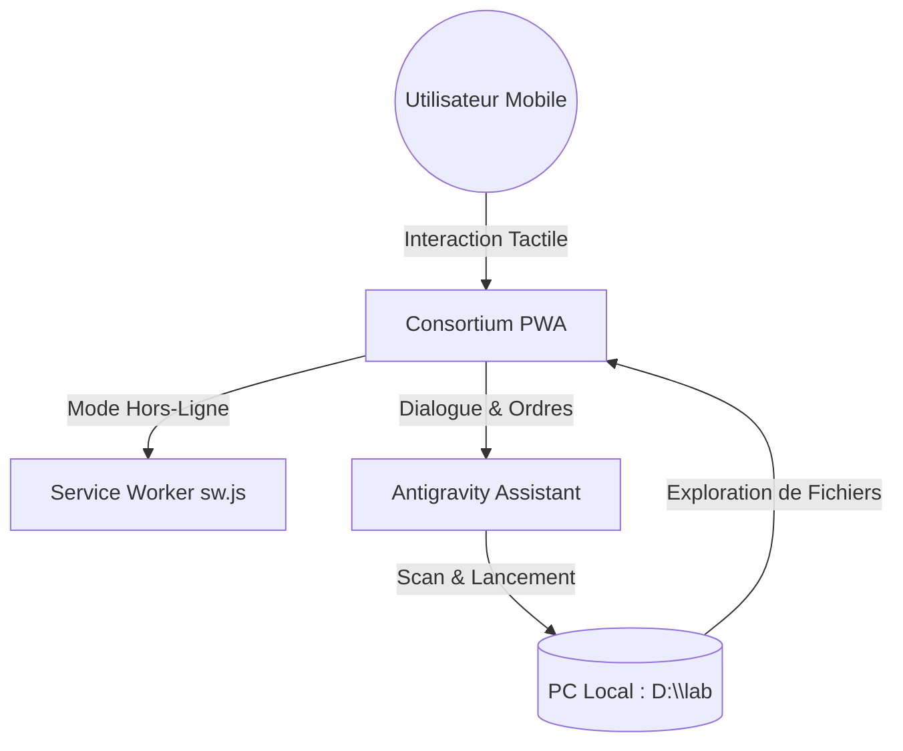

# Structure du Projet Consortium v3.5

Ce document sert de référence technique pour l'organisation du projet.

## 📁 Architecture des Fichiers

| Fichier | Rôle | État |
| :--- | :--- | :--- |
| `index.html` | Structure HTML5, design Tailwind CSS & Glassmorphism. | ✅ Opérationnel |
| `app.js` | Logique applicative, gestion de l'Explorateur et Chat IA. | ✅ Opérationnel |
| `sw.js` | Service Worker pour la PWA et la gestion du cache v3.x. | ✅ Opérationnel |
| `manifest.json` | Configuration PWA pour installation sur mobile/bureau. | ✅ Opérationnel |
| `vercel.json` | Configuration pour le déploiement CI/CD sur Vercel. | ✅ Opérationnel |
| `style.css` | Styles CSS additionnels (Legacy). | ℹ️ Secondaire |

## 🚀 Fonctionnalités Clés
- **Explorateur Universel** : Accès aux disques C: et D: via l'onglet Projets.
- **Antigravity AI** : Dialogue à distance et commandes de lancement de projet.
- **Masterwork UI** : Design premium responsive (PC/Mobile/Split-Screen).
- **Zero-Overflow** : Confinement horizontal total pour une fluidité parfaite.

## 🛠️ Workflow de Développement
1. Modification du code local.
2. Push Git vers le dépôt distant.
3. Déploiement automatique vers `consortium-nine.vercel.app`.
4. Mise à jour du cache via `sw.js` (incrémentation de version).

---
*Document généré par Antigravity - Binôme IA*

## 📊 Schéma de la Structure

