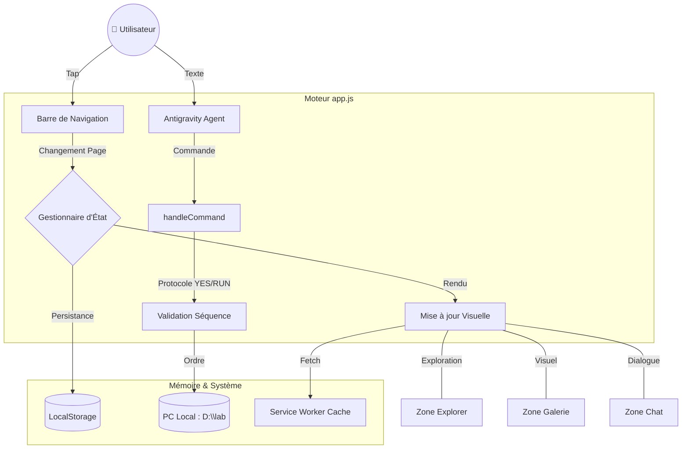

# 🌌 Architecture Consortium v9.0 (Masterwork)

Ce document est la référence technique officielle du projet consolidé.

## 📁 Fichiers Actifs (Zéro-Redondance)

| Fichier | Rôle | État |
| :--- | :--- | :--- |
| `index.html` | Interface PWA, Design Masterwork & Tailwind. | ✅ Consolidé |
| `app.js` | Moteur v9.0, Gestionnaire d'Explorer & Protocole Agent. | ✅ Actif |
| `sw.js` | Service Worker v9.0 (Gestion cache sélective). | ✅ Actif |
| `manifest.json` | Configuration PWA & Identité visuelle. | ✅ Actif |
| `README.md` | Guide d'utilisation et philosophie du projet. | ✅ À jour |

## 🚀 Fonctions Centrales

### 1. Explorateur Universel
Accès direct aux répertoires de travail (`D:\lab`). Filtration intelligente pour ne montrer que les projets et les dossiers "App".

### 2. Protocole Agent Antigravity
Système de commande textuelle avec interception de mots-clés :
- `YES` / `ACCEPT` / `RUN` : Déclenche la validation de séquence PC.
- `LAB` / `EXPLORER` : Commande de navigation rapide.

### 3. Système Auto-Reload
Détection de version intelligente qui force la mise à jour du navigateur dès qu'une nouvelle version est déployée par le binôme IA.

## 🛠️ Maintenance & Déploiement
- **CI/CD** : Déploiement automatique via Vercel à chaque push.
- **Cache** : Stratégie de mise à jour forcée via incrémentation de `CACHE_NAME`.

---
*Document certifié par le Cerveau Antigravity - v9.0*

## 📊 Schéma Fonctionnel (Miroir Technique)

## 🧩 Correspondance Interface / Code

| Élément UI | Fonction Code | Rôle |
| :--- | :--- | :--- |
| **Bouton Projets** | `renderProjects()` | Scanne `D:\lab` et affiche la liste Windows-Style. |
| **Barre Chat** | `sendMessage()` | Envoie votre texte au `handleCommand` pour analyse. |
| **Cartes Galerie** | `renderGallery()` | Affiche vos visuels Masterwork avec effet de survol. |
| **Fil d'Ariane** | `split('\\')` | Découpe le chemin actuel pour permettre le retour en arrière. |
| **Badge Sync** | `animate-pulse` | Confirme visuellement que le protocole PC-Link est prêt. |
